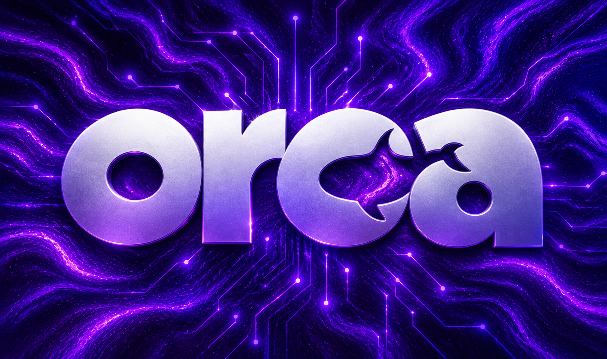

# اورکا MCP - هوش فیلم و سریال برای ایجنت‌ها



یه MCP سرور عمومیه که به ایجنت‌های هوش مصنوعی دانش واقعی فیلم و سریال میده: جستجو، نمره‌ها از چند منبع، رتبه IMDb Top 250 و Letterboxd Top 500، کجا ببینم، قسمت‌ها، آرتوورک. فقط خواندنیه، بدون کلید.

**آدرس زنده:** `https://orca-mcp.mmdju.workers.dev/mcp` (Streamable HTTP، بدون state)

## اتصال در ۳۰ ثانیه

هر MCP کلاینتی، فقط یه آدرس. OpenCode (`opencode.jsonc`):

```json
{
  "mcp": {
    "orca-mcp": {
      "type": "remote",
      "url": "https://orca-mcp.mmdju.workers.dev/mcp",
      "enabled": true
    }
  }
}
```

Claude Desktop / Cursor (استایل `mcp.json`):

```json
{
  "mcpServers": {
    "orca-mcp": { "url": "https://orca-mcp.mmdju.workers.dev/mcp" }
  }
}
```

بعدش فقط حرف بزن: «رتبه گادفادر تو IMDb و Letterboxd چنده؟»، «یه علمی‌تخیلی خوب بعد ۲۰۲۰ با نمره بالای ۸»، «کارگردان دون کیه و دیگه چی ساخته؟»، «بریکینگ بد رو کجا ببینم؟»

## ۲۱ ابزار

| ابزار | به چه دردی می‌خوره |
|---|---|
| `movies_search` | جستجوی فیلم، سریال و آدم‌ها با اسم (فارسی/انگلیسی) |
| `movies_details` | داستان، ژانر، همه نمره‌ها، بازیگرها، کارگردان، تریلر، جوایز، پوستر |
| `movies_discover` | فیلتری (ژانر، کلیدواژه، استودیو، سال، حداقل نمره، حداقل رای) با مرتب‌سازی |
| `movies_trending` | الان چی ترنده (روز/هفته) |
| `movies_where_to_watch` | نتفلیکس، پرایم، دیزنی‌پلاس و... به تفکیک کشور |
| `movies_compare_lists` | رتبه IMDb Top 250 در برابر Letterboxd Top 500 |
| `movies_ratings` | نمره TMDB و IMDb و Rotten Tomatoes و Metacritic، آیدی‌ها رو خودش پیدا می‌کنه |
| `movies_collection` | ترتیب دیدن فرنچایز با مدت هر قسمت، مجموع مدت و پخش هر قسمت |
| `movies_similar` | «شبیه Whiplash چی ببینم؟» |
| `movies_person` | بیو، عکس، مهم‌ترین بازی‌ها و کارگردانی‌ها |
| `movies_artwork` | پوستر، بک‌دراپ، لوگو، بنر |
| `tv_episodes` | لیست قسمت‌ها با تاریخ پخش و خلاصه |
| `movies_reviews` | نظر مردم: نقدها با نمره نویسنده |
| `movies_videos` | تریلر، تیزر و کلیپ با لینک یوتیوب |
| `tv_season` | یه فصل کامل: نمره، مدت، عکس هر قسمت |
| `tv_episode` | یه قسمت: کارگردان، نویسنده، بازیگرهای مهمان |
| `find_by_external_id` | آیدی IMDb (`tt...`) به آیدی TMDB |
| `movies_keywords` | کلمه مضمون به آیدی کلیدواژه («zombie») |
| `movies_companies` | اسم استودیو به آیدی («A24») |
| `person_watch_path` | از کجای یه بازیگر/کارگردان شروع کنم |
| `release_calendar` | فیلم‌های آینده / سریال‌های در حال پخش |

نکته‌ها برای سازنده‌های ایجنت:

- اسم، آیدی TMDB و آیدی IMDb (`tt...`) رو به‌جای هم قبول می‌کنه — آیدی‌ها داخلی حل میشن.
- `movies_discover` پیش‌فرض `min_votes: 300` داره چون میانگین با رای کم نویزه. آیتم‌های زیر این حد `low_votes: true` می‌گیرن — به کاربر هشدار بده به‌جای اینکه نمره رو به‌عنوان واقعیت نشون بدی.
- فیلم‌های تازه معلومه که رایشون کمه: از `movies_trending` یا `discover` با `sort: newest` و `min_votes` پایین استفاده کن.
- نتیجه‌ها سقف دارن (پیش‌فرض ۱۰، حداکثر ۵۰) تا کانتکست ایجنت حفظ بشه.

نکته: فارسی هم می‌فهمه (`language: fa-IR`) — اسم و خلاصه فارسی هرجا که باشه.

## منابع داده

- TMDB (متادیتا، ترند، کجا ببینم) — یه کلید مشترک سروری، با throttle و کش مرکزی
- اسنپ‌شات نمره‌های IMDb (دیتاست آفلاین، دوره‌ای تازه میشه)
- Rotten Tomatoes و Metacritic و جوایز از OMDb (وقتی ست باشه)
- IMDb Top 250 و Letterboxd Top 500 از APIهای عمومی خودمون
- TVMaze (قسمت‌ها)، Fanart.tv (آرتوورک)، Cinemeta (جایگزین)

## اتریبیوشن

This product uses the TMDB API but is not endorsed or certified by TMDB. See https://www.themoviedb.org. TV episode data by TVMaze (CC BY-SA 4.0). Watch-provider data by JustWatch, via TMDB. IMDb rating data: Information courtesy of IMDb (https://www.imdb.com). Used with permission. Artwork by Fanart.tv contributors.

## وضعیت

سرویس عمومی رایگان روی Cloudflare Workers. مصرف منصفانه — اگه فشار بیاری rate-limit میشی.

## لایسنس

ریپوی ویترین (فقط داک، بدون سورس) — ببین [LICENSE](LICENSE). نکته‌های امنیتی تو [SECURITY.md](SECURITY.md).
